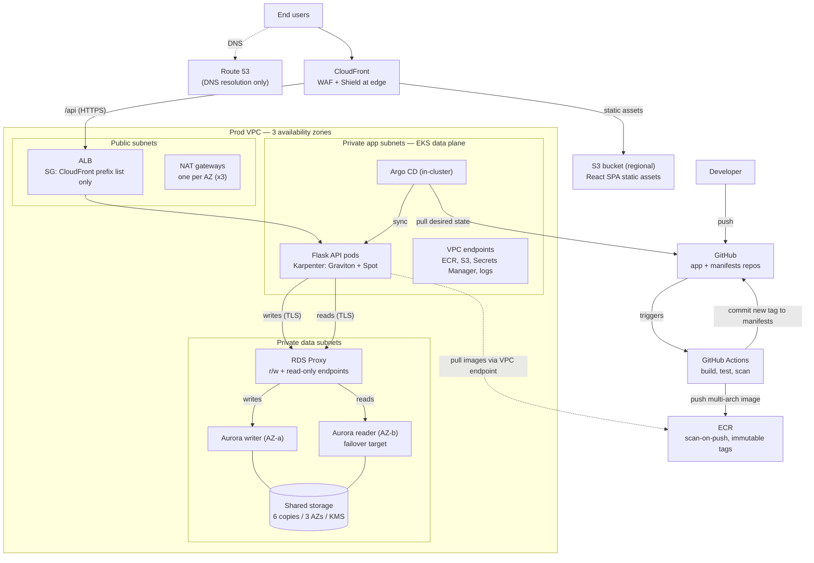

# Innovate Inc. — Cloud Architecture Design

**Cloud provider:** Amazon Web Services (AWS)
**Application:** React SPA + Python/Flask REST API + PostgreSQL
**Goals:** robust, scalable (a few hundred → millions of users), secure (sensitive
data), cost-effective, managed Kubernetes, CI/CD.

---

## Table of contents

1. [Executive summary](#1-executive-summary)
2. [Assumptions & guiding principles](#2-assumptions--guiding-principles)
3. [High-level architecture diagram](#3-high-level-architecture-diagram)
4. [Cloud environment structure (AWS accounts)](#4-cloud-environment-structure-aws-accounts)
5. [Network design](#5-network-design)
6. [Compute platform (Amazon EKS)](#6-compute-platform-amazon-eks)
7. [Database (PostgreSQL)](#7-database-postgresql)
8. [CI/CD](#8-cicd)
9. [Cost optimization](#9-cost-optimization)
10. [Observability & operations](#10-observability--operations)
11. [Growth path: a few hundred → millions of users](#11-growth-path-a-few-hundred--millions-of-users)

---

## 1. Executive summary

| Area          | Recommendation                                                                                                   |
| ------------- | --------------------------------------------------------------------------------------------------------------- |
| **Accounts**  | AWS Organizations + Control Tower. Start with **Management, Log Archive, Audit, Shared Services, Dev, Prod** (add Staging as growth demands). Isolation by account, not just namespace. |
| **Network**   | One VPC per workload account, 3 AZs, three subnet tiers (public / private-app / private-data). Private nodes & DB, edge protected by CloudFront + WAF + Shield, private connectivity via VPC endpoints. |
| **Compute**   | **Amazon EKS** with a small managed system node group + **Karpenter** for workloads on **Graviton + Spot**. HPA for pods, Karpenter for nodes. GitOps delivery with Argo CD. |
| **Containers**| Multi-stage, **multi-arch** images built in CI, stored in **ECR** (scan-on-push, immutable tags), deployed via Argo CD. |
| **Database**  | **Amazon Aurora PostgreSQL** (multi-AZ cluster), **RDS Proxy** for pooling, PITR backups, **Aurora Global Database** for cross-region DR. |
| **Secrets**   | AWS Secrets Manager + KMS, mounted via IRSA / Pod Identity; automatic rotation. |

The design deliberately **starts small and cheap** (single NAT in non-prod,
minimal always-on compute, low DB instance sizes) while every layer has a
**documented, low-friction scaling path** to millions of users.

---

## 2. Assumptions & guiding principles

**Assumptions**

- Initial load is low (hundreds of users/day); the architecture must scale ~1000× without a redesign.
- "Sensitive user data" implies a compliance trajectory (SOC 2 / GDPR / possibly HIPAA-like) → encryption everywhere, strong isolation, auditability.
- The team is small and cloud-inexperienced → **prefer managed services** over self-managed, and **codify everything** so the platform is reproducible.
- Frequent deploys → first-class CI/CD with fast, safe rollbacks.

**Why AWS (vs GCP)?** Both are excellent; AWS is chosen for the depth of its
managed-Kubernetes + data ecosystem (EKS, Karpenter, Aurora, RDS Proxy),
mature multi-account governance (Organizations/Control Tower), and because it
lets us reuse the **exact EKS + Karpenter + Graviton/Spot** pattern from the
technical task. (The GKE Autopilot + Cloud SQL/AlloyDB equivalent is a valid
alternative and the same principles map across.)

**Principles**

1. **Managed-first** — offload undifferentiated heavy lifting (control plane, DB, DNS, CDN).
2. **Least privilege & isolation** — separate accounts, per-pod IAM, private-by-default networking.
3. **Everything as code** — Terraform for infra, Helm/Kustomize for workloads, Git as the source of truth.
4. **Cost-aware by design** — Graviton + Spot, autoscale to zero-ish, pay for what you use.
5. **Resilient by default** — multi-AZ everywhere, automated backups, tested DR.

---

## 3. High-level architecture diagram


*(The SVG is a draw.io export with the source embedded — open it in
[draw.io](https://app.diagrams.net) to edit. The Mermaid version below mirrors
it for text-based review.)*



Key properties the diagram encodes deliberately:

- **Route 53 is DNS-only** — it never carries traffic; users connect to CloudFront.
- **S3 is a regional CloudFront origin**, not an edge component.
- **The ALB only accepts the CloudFront managed prefix list**, so WAF cannot be
  bypassed by hitting the ALB directly.
- **GitOps is pull-based**: CI never talks to the cluster. Actions pushes the
  image and commits the tag back to Git; Argo CD (running inside EKS) pulls.
- **Aurora has exactly one writer** (single AZ); HA comes from the shared
  storage layer (6 copies across 3 AZs) plus reader promotion — there is no
  instance-to-instance replication stream between writer and reader.
- The **EKS control plane is not drawn inside the VPC** — it runs in an
  AWS-managed VPC and attaches ENIs into the private subnets.

---

## 4. Cloud environment structure (AWS accounts)

**Recommendation: AWS Organizations governed by AWS Control Tower**, with a
small set of purpose-built accounts organized into Organizational Units (OUs).

| Account            | OU             | Purpose                                                                                     | Why separate                                                 |
| ------------------ | -------------- | ------------------------------------------------------------------------------------------- | ----------------------------------------------------------- |
| **Management**     | Org root       | Consolidated billing, Service Control Policies (SCPs), Control Tower. **No workloads.**    | Blast-radius: the most privileged account holds nothing to attack. |
| **Log Archive**    | Security       | Immutable, central sink for CloudTrail, Config, and VPC flow logs.                          | Tamper-evident audit trail even if a workload account is compromised. |
| **Audit / Security** | Security     | Aggregates GuardDuty, Security Hub, Access Analyzer; home for the security team's read access. | Central threat detection, separation of duties.             |
| **Shared Services**| Infrastructure | CI/CD runners, a shared/promoted ECR, central DNS, (later) Transit Gateway.                 | Shared platform tooling used by all environments.           |
| **Dev**            | Workloads      | Non-prod experimentation and PR/preview environments.                                        | Freedom to break things without touching prod.              |
| **Prod**           | Workloads      | Customer-facing workload + production data.                                                  | Strongest controls, tightest access, separate billing.      |
| **Staging** *(later)* | Workloads   | Prod-like pre-production validation.                                                      | Add when release risk justifies a full mirror.               |

**Why multiple accounts (not one account + namespaces)?**

- **Isolation / blast radius** — an account is AWS's hardest security & quota
  boundary. A mistake or breach in Dev cannot reach Prod data.
- **Billing clarity** — per-account cost attribution out of the box.
- **Security & compliance** — least-privilege by construction; auditors love it.
- **Service quotas** — limits (e.g. EIPs, Spot capacity) are per-account, so Dev
  load-testing can't starve Prod.

**Identity & guardrails**

- **AWS IAM Identity Center (SSO)** for human access — no long-lived IAM users;
  federate from the company IdP, assume roles per account.
- **SCPs** enforce org-wide rules: deny disabling CloudTrail/GuardDuty, restrict
  regions, deny public S3, require encryption.
- Right-sized for a startup: **6 accounts to start**, expandable — you get the
  benefits of separation without drowning a small team in overhead.

---

## 5. Network design

### VPC topology (per workload account)

One VPC per environment, spanning **3 Availability Zones**, with **three subnet
tiers** so trust boundaries map onto the network:

| Tier              | Contains                                   | Internet route            |
| ----------------- | ------------------------------------------ | ------------------------- |
| **Public**        | ALB, NAT gateways                          | Internet Gateway (ingress/egress) |
| **Private — app** | EKS nodes & pods (Flask API)               | Egress only, via NAT      |
| **Private — data**| Aurora, ElastiCache (future), RDS Proxy    | **No internet route**     |

Each environment gets its **own /16** — e.g. Dev `10.10.0.0/16`, Prod
`10.20.0.0/16`, matching the [`terraform/`](../terraform) tfvars — so CIDRs never
overlap and the VPCs can be peered/transit-gateway'd later. Example layout
within one environment's /16 (shown for `10.0.0.0/16`):

| Subnet        | AZ-a         | AZ-b         | AZ-c         |
| ------------- | ------------ | ------------ | ------------ |
| Public /24    | 10.0.48.0/24 | 10.0.49.0/24 | 10.0.50.0/24 |
| Private app /20 | 10.0.0.0/20 | 10.0.16.0/20 | 10.0.32.0/20 |
| Private data /24 | 10.0.52.0/24 | 10.0.53.0/24 | 10.0.54.0/24 |

Large `/20` app subnets give the VPC CNI plenty of pod IP space.

> **Note vs. the POC:** the [`terraform/`](../terraform) POC uses the
> `x.x.52–54.0/24` range as *intra* subnets for the EKS control-plane ENIs (it
> deploys no database). In this target design that range is the private-data
> tier; the control-plane ENIs get their own small subnets alongside it.

### Securing the network — defense in depth

**Edge**
- **Amazon CloudFront** fronts both the SPA (cached S3 origin) and the API,
  terminating TLS (ACM cert) close to users.
- **AWS WAF** on CloudFront: managed rule sets (OWASP top-10, bot control), rate
  limiting, and geo rules.
- **AWS Shield Standard** (free, always on) for DDoS; **Shield Advanced** later
  if the risk profile warrants.

**Ingress into the VPC**
- Only the **ALB** in public subnets is internet-reachable, and its security
  group admits **only the CloudFront managed prefix list** (optionally verified
  with a custom origin header) — the edge WAF cannot be bypassed by hitting the
  ALB directly.
- The ALB is provisioned by the **AWS Load Balancer Controller** from Kubernetes
  `Ingress` objects.
- Nodes and the database are in **private subnets** — never directly exposed.
- The **EKS API endpoint is private** (or public but locked to office/VPN CIDRs).

**Egress & private connectivity**
- **NAT gateways** (one per AZ in prod for HA; a single NAT is acceptable in
  non-prod as a cost trade-off) for outbound from private subnets.
- **VPC endpoints** for S3 (gateway), ECR, STS, Secrets Manager, CloudWatch, etc.
  — keeps AWS-service traffic on the AWS backbone (**more secure and cuts NAT
  data-processing cost**).

**Inside the VPC / cluster**
- **Security groups** as the primary, stateful, least-privilege firewall:
  the **Aurora SG accepts 5432 only from the RDS Proxy SG**, and the
  **RDS Proxy SG accepts 5432 only from the EKS node/pod SG**. NACLs as a
  coarse secondary layer.
- **Kubernetes NetworkPolicies** (VPC CNI network policy or Cilium) for
  pod-to-pod segmentation (e.g. only the API may reach the DB egress path).
- **VPC Flow Logs** → Log Archive account for forensics.
- **Encryption in transit** everywhere (TLS to the ALB, ALB→pod, pod→Aurora).

---

## 6. Compute platform (Amazon EKS)

### Why EKS

Managed control plane (multi-AZ, patched, 99.95% SLA), deep AWS integration
(IAM, VPC CNI, Load Balancer Controller, EBS/EFS CSI), and a portable,
standards-based Kubernetes API the team can hire for. The control plane runs in
an **AWS-managed VPC** and attaches ENIs into our private subnets — we never
operate or patch it.

### Cluster & node strategy

A **two-layer** node design (this is exactly the pattern implemented in the
[`terraform/`](../terraform) task):

1. **System node group (EKS-managed, on-demand, small).** 2–3 nodes across AZs
   hosting cluster-critical add-ons (CoreDNS, controllers) and the **Karpenter**
   controller itself. On-demand for stability — these must not be interrupted.
2. **Karpenter-managed workload nodes (just-in-time).** Karpenter watches
   unschedulable pods and launches the **cheapest instance that fits**, drawing
   from a wide pool of **Graviton (arm64) + x86, Spot-first with on-demand
   fallback**. It bin-packs and **consolidates** idle capacity automatically.

**Workload placement policy**

| Workload                         | Capacity              | Rationale                                    |
| -------------------------------- | --------------------- | -------------------------------------------- |
| Stateless Flask API (many replicas) | **Graviton + Spot**   | Cheapest; interruptions absorbed by replicas + PDBs |
| Platform/stateful (controllers, ingress) | On-demand (system group) | Stability                              |
| Batch / async jobs               | Spot (any arch)       | Cost; naturally retryable                     |

### Scaling

- **Horizontal Pod Autoscaler (HPA)** scales pod replicas on CPU/memory or custom
  metrics (e.g. request rate via Prometheus Adapter / KEDA).
- **Karpenter** scales nodes in seconds to match pending pods, and scales back
  down via consolidation — no static node-group guesswork.
- **Pod Disruption Budgets** keep a minimum number of API replicas available
  during Spot reclaims, node consolidation, and upgrades.
- **Topology spread constraints** distribute replicas across AZs.

### Resource allocation & multi-tenancy hygiene

- **Namespaces** per app/team/environment-slice.
- **Requests/limits** on every container (and enforced defaults via **LimitRange**).
- **ResourceQuota** per namespace to cap spend/footprint.
- **PriorityClasses** so API pods evict batch pods under pressure.
- **Pod Security Admission** (restricted), non-root, read-only root filesystem,
  dropped Linux capabilities.

### Containerization strategy

- **Image building** — multi-stage Dockerfiles (small, no build tools in the
  runtime image). Built in CI with **`docker buildx` for multi-arch
  (`linux/amd64,linux/arm64`)** so the *same* image runs on x86 or Graviton — a
  prerequisite for the Graviton/Spot savings above.
- **Registry** — **Amazon ECR** (private): **scan-on-push** (or Inspector),
  **immutable tags**, and **lifecycle policies** to expire old images. Nodes
  pull images over the **ECR VPC endpoints**, not the NAT path. Optionally
  **cosign** image signing + a Kyverno policy that only admits signed images.
- **Deployment** — **GitOps with Argo CD, pull-based**: CI pushes the image to
  ECR and commits the new tag to the Git config repo; **Argo CD, running inside
  the cluster, pulls from Git** and reconciles the cluster to the declared
  state. CI never talks to the cluster. Benefits: auditable history, trivial
  rollback (`git revert`), and no cluster-admin creds in CI.
  **Argo Rollouts** adds canary/blue-green with automated metric-based rollback.
- **Pod → AWS access** via **EKS Pod Identity / IRSA** — each workload assumes a
  narrowly-scoped IAM role (e.g. read one Secrets Manager secret), never node
  credentials.

---

## 7. Database (PostgreSQL)

### Recommendation: Amazon Aurora PostgreSQL

**Aurora PostgreSQL** (PostgreSQL-compatible) is recommended over self-managed
PostgreSQL on EC2 and, for this growth profile, over plain RDS PostgreSQL:

| Capability                | Aurora PostgreSQL                              | RDS PostgreSQL                          | Self-managed on EC2 |
| ------------------------- | ---------------------------------------------- | --------------------------------------- | ------------------- |
| Storage                   | Auto-grows to 128 TiB, 6 copies across 3 AZs   | Provisioned, manual grow                | You manage disks    |
| Read scaling              | Up to 15 replicas on **shared storage, typically ms-level lag** | Up to 15 replicas via **async WAL streaming, lag varies with write load** | DIY |
| Failover                  | Typically **< 30 s** to a reader               | 60–120 s (Multi-AZ instance); ~35 s (Multi-AZ DB cluster) | DIY |
| Cross-region DR           | **Global Database** (RPO ~1 s)                 | Cross-region read replica               | DIY                 |
| Ops burden                | Fully managed                                  | Fully managed                           | High                |

Self-managed Postgres is explicitly **not** recommended — it puts backups, HA,
patching, and failover on a small team for no benefit. If absolute cost at tiny
scale is the top priority, **RDS PostgreSQL Multi-AZ** is a cheaper starting
point with a clean upgrade path to Aurora; the design below assumes Aurora.

### Topology & connection management

- **One writer + reader(s) across AZs.** Aurora has exactly one writer instance
  at a time; readers serve reads and act as failover targets.
- **Amazon RDS Proxy** sits between the pods and Aurora to **pool and multiplex
  connections** — important because a horizontally-scaled Flask fleet can open
  many connections — and it **speeds up failover** transparently. The app
  connects **only to the proxy**: the **proxy's default (read/write) endpoint**
  for writes and its **read-only endpoint** for read-heavy queries. The proxy
  targets the Aurora cluster endpoints internally.
- Runs in the **private data subnets**; Aurora accepts 5432 only from the proxy
  SG, and the proxy accepts 5432 only from the EKS node/pod SG.

### High availability

- **Multi-AZ at the cluster level** — Aurora's storage is replicated 6 ways
  across 3 AZs; instances (writer, readers) are placed in different AZs. Note
  the writer itself is a single instance in a single AZ — HA comes from the
  storage layer plus reader promotion, not from a "multi-AZ writer".
- Readers share the **same storage volume** as the writer — there is no
  instance-to-instance replication stream to lag or break.
- Automatic failover promotes a reader on writer failure (typically < 30 s).
- The proxy's read-only endpoint load-balances read traffic across replicas.

### Backups

- **Automated continuous backups to S3** with **Point-In-Time Recovery (PITR)**;
  retention **7–35 days** (35 in prod).
- **Manual/scheduled snapshots** for milestones and pre-migration safety.
- **Cross-region snapshot copy** for an independent DR copy.
- Backups **encrypted with KMS**; restores are tested on a schedule (a backup you
  haven't restored is a hope, not a backup).

### Disaster recovery

- **Aurora Global Database**: a secondary read-only cluster in a second region
  with **RPO ~1 second** and fast promotion (**RTO typically < 1 minute** for the
  DB tier). Protects against a full regional outage.

| Scenario            | Mechanism                              | RPO      | RTO         |
| ------------------- | -------------------------------------- | -------- | ----------- |
| AZ failure          | Reader promotion (shared storage)      | ~0       | < 30 s      |
| Accidental delete / bad migration | PITR restore             | ≤ 5 min  | minutes     |
| Region failure      | Global Database promotion              | ~1 s     | < 1 min (DB) + app failover |

### Database security

- **Encryption at rest** (KMS) and **in transit** (TLS/`sslmode=require`).
- **No public accessibility**; private data subnets only.
- Credentials in **Secrets Manager** with **automatic rotation**, retrieved by
  pods via Pod Identity/IRSA (optionally **IAM database authentication**).
- Least-privilege DB roles; audit logging shipped to CloudWatch/Log Archive.

---

## 8. CI/CD

Deployment frequency is a first-class requirement, so the pipeline is designed
for **fast, safe, auditable** releases:

```
Developer → GitHub PR → GitHub Actions
   ├─ lint + unit/integration tests
   ├─ build multi-arch image (buildx: amd64 + arm64)
   ├─ scan image (Trivy / ECR / Inspector) + SBOM
   ├─ push to ECR (immutable tag = git SHA)
   └─ open PR bumping the image tag in the GitOps config repo
                                   │
              Argo CD (in-cluster) pulls Git ──► reconciles EKS (dev → staging → prod)
                                   └─ Argo Rollouts: canary + auto-rollback on bad metrics
```

- **Separation of concerns:** the app repo builds artifacts; a **config repo**
  (Kustomize/Helm) declares desired state per environment. Promotion = a Git
  change, reviewed and merged.
- **Pull-based, not push-based:** CI's job ends at Git. **No standing cluster
  credentials in CI** — Argo CD pulls from Git from inside the cluster,
  shrinking the attack surface.
- **Rollback** is `git revert`; **release history** is the Git log.

---

## 9. Cost optimization

- **Graviton + Spot** for the stateless API (up to ~90% off on-demand via Spot;
  ~20–40% better price/performance on Graviton), with on-demand fallback.
- **Karpenter consolidation** continuously bin-packs and removes idle nodes —
  you pay for actual demand, not a padded static fleet.
- **SPA on S3 + CloudFront** instead of running it in pods — cheap, fast, scales
  infinitely.
- **VPC endpoints** cut NAT data-processing charges for AWS-service traffic
  (image pulls are the big one).
- **Right-sized start:** small Aurora instance, single-NAT in non-prod (per-AZ
  NAT in prod), scale up as metrics demand.
- **Governance:** Cost Explorer, budgets/alerts, per-account and per-tag
  attribution; Compute Savings Plans once steady-state on-demand usage is known.

---

## 10. Observability & operations

- **Metrics:** CloudWatch Container Insights and/or **Amazon Managed Prometheus +
  Managed Grafana**; HPA/KEDA consume custom metrics.
- **Logs:** Fluent Bit → CloudWatch Logs (and/or OpenSearch), centralized in Log
  Archive.
- **Tracing:** OpenTelemetry → AWS X-Ray for request-level latency across SPA →
  API → DB.
- **Alerting:** SLO-based alerts (latency, error rate, saturation) to
  PagerDuty/Slack.
- **Security ops:** GuardDuty (incl. EKS Protection), Security Hub, Config rules,
  Inspector for image/host CVEs.

---

## 11. Growth path: a few hundred → millions of users

| Stage | Users | What changes |
| ----- | ----- | ------------ |
| **Launch** | 100s/day | Single region; small Aurora writer + 1 reader; Karpenter min footprint; single-NAT in non-prod (per-AZ NAT in prod from day one). |
| **Traction** | 10k–100k | Add Aurora readers + route reads via the proxy's read-only endpoint; HPA thresholds tuned; add Staging account; caching (ElastiCache/Redis) + CloudFront API caching. |
| **Scale** | 1M+ | Aurora Global Database (multi-region DR / read-local); shard or offload hot paths; per-service namespaces/teams; Shield Advanced; SLOs + error budgets; FinOps with Savings Plans. |

**Nothing in the launch design has to be thrown away to get to scale** — the
account, network, EKS/Karpenter, and Aurora foundations were chosen precisely so
that growth is a matter of turning dials (replicas, regions, readers), not
re-architecting.
